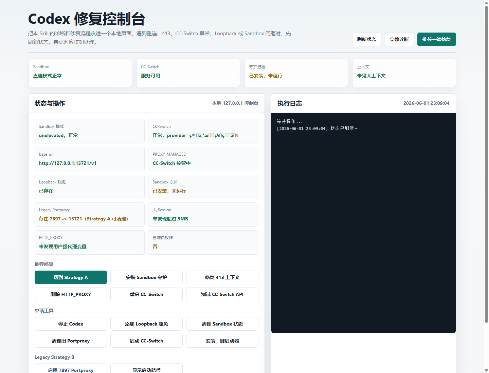

<!-- 算个文科生吧，联系方式WX：RabbitRobot2025 -->

# ljh-codex-desktop-loopback-repair-skill

[中文说明](#中文说明) | [English](#ljh-codex-desktop-loopback-repair-skill)

A Codex Skill for diagnosing and repairing Codex Desktop loopback proxy failures on Windows.

It targets four common failure modes:

1. **Reconnecting / stream disconnected** — elevated sandbox WFP blocks 15721, deadlocks with CC-Switch Live Takeover
2. **413 Payload Too Large** — conversation context exceeds CC-Switch's 10 MB request body limit
3. **CC-Switch credential loss** — provider becomes null or reports "No credentials" after crash
4. **Upstream API server down** — CC-Switch healthy but all requests timeout due to unreachable upstream endpoint

## 中文说明

这是一个用于修复 Windows 上 Codex Desktop 本地代理/回环访问问题的 Codex Skill。它把常见故障的诊断和修复流程整理成 Skill，并提供一个本地 Web 修复控制台，后续遇到同类问题时可以直接点按钮处理。

常见适用场景：

1. **Codex 一直 Reconnecting / stream disconnected**：`sandbox = "elevated"` 时，Windows 沙箱防火墙规则会阻断 `127.0.0.1:15721`，而 CC-Switch Live Takeover 又会把 `base_url` 写回 15721，形成死锁。
2. **413 Payload Too Large**：当前会话上下文过大，请求体超过上游 API 限制，需要归档大 session 或开启新会话。
3. **CC-Switch 凭据/Provider 丢失**：CC-Switch 崩溃或重启后，可能出现 `current_provider = null` 或 `No credentials`。
4. **上游 API 服务器宕机**：CC-Switch 状态正常但请求全部超时，上游 endpoint（如 llm4.slashrobot.top）不可达，需要切换供应商或修复数据库。
5. **HTTP_PROXY 污染**：用户级 `HTTP_PROXY` / `HTTPS_PROXY` 指向不可用的本地端口时，会导致 CC-Switch 出站请求失败。

### 中文快速安装

把本仓库复制到 Codex skills 目录：

```powershell
Copy-Item -Recurse -Force .\ljh-codex-desktop-loopback-repair-skill "$env:USERPROFILE\.codex\skills\ljh-codex-desktop-loopback-repair-skill"
```

然后重启 Codex Desktop，或重新打开一个 Codex 会话。

### 中文 Web 修复控制台



从仓库根目录启动：

```bat
start-repair-web.bat
```

或者直接运行 PowerShell 服务：

```powershell
powershell -ExecutionPolicy Bypass -File .\scripts\start-repair-web.ps1
```

打开地址：`http://127.0.0.1:8765/`。使用时保持启动窗口不要关闭；如果想让页面同时清理防火墙规则、Sandbox 用户和 `netsh interface portproxy`，请用管理员权限启动。

### 中文按钮说明

| 按钮 | 功能 |
| --- | --- |
| 刷新状态 | 读取 `config.toml`、CC-Switch 状态、Loopback 豁免、Sandbox 守护、Portproxy、代理环境变量和大 session 文件。 |
| 完整诊断 | 在日志面板输出当前诊断结果和建议修复方向。 |
| 推荐一键修复 | 停止 Codex，删除用户级代理变量，切到 `sandbox = "unelevated"`，添加 Loopback 豁免；如果有管理员权限，还会清理 Sandbox 状态和旧 Portproxy，并在必要时重启 CC-Switch。 |
| 切到 Strategy A | 应用推荐方案：使用 `unelevated` 沙箱，直接连接 CC-Switch 的 `127.0.0.1:15721`。 |
| 安装 Sandbox 守护 | 安装并启动守护脚本，防止 CC-Switch 重启后反复把 `sandbox` 改回 `elevated`。 |
| 修复 413 上下文 | 停止 Codex，并归档当天 `.jsonl` 会话文件，清掉过大的上下文。 |
| 删除 HTTP_PROXY | 删除用户级 `HTTP_PROXY`、`HTTPS_PROXY`、`http_proxy`、`https_proxy`，避免 CC-Switch 出站请求被错误代理劫持。 |
| 重启 CC-Switch | 从已知路径停止并重启 CC-Switch，适合 provider 丢失或凭据恢复失败时使用。 |
| 测试 CC-Switch API | 向 `http://127.0.0.1:15721/v1/responses` 发送小请求，验证 CC-Switch 是否能正常转发。 |
| 检查上游连通 | 从 CC-Switch 数据库读取当前供应商的上游 URL，直接测试其连通性。 |
| CC-Switch 深度恢复 | 停止 CC-Switch、清理 proxy_live_backup、切换到可用供应商、重启 CC-Switch。 |
| 停止 Codex | 停止正在运行的 Codex 进程，方便后续修复。 |
| 添加 Loopback 豁免 | 给当前 OpenAI/Codex MSIX 包添加 `CheckNetIsolation LoopbackExempt`。 |
| 清理 Sandbox 状态 | 删除已知 Codex Sandbox 防火墙规则和 Sandbox 用户，需要管理员权限。 |
| 清理旧 Portproxy | 删除旧的 `127.0.0.1:7897 -> 127.0.0.1:15721` 映射，需要管理员权限。 |
| 启动 CC-Switch | CC-Switch 未运行时，从常见安装路径启动它。 |
| 安装一键启动器 | 把 `start-codex.bat` 复制到 `%USERPROFILE%\.codex\start-codex.bat`。 |
| 启用 7897 Portproxy | 启用 Legacy Strategy B，仅用于必须保留 `sandbox = "elevated"` 的场景；需要管理员权限，并且会和 CC-Switch Live Takeover 冲突。 |
| 显示启动路径 | 在日志面板显示本地一键启动器路径。 |

### 中文推荐修复顺序

```text
停止 Codex
  ↓
诊断 sandbox、CC-Switch、Loopback、Portproxy、上游连通、Session
  ↓
优先切到 Strategy A：sandbox = "unelevated"，直连 15721
  ↓
确认 CC-Switch provider 正常；不正常则等待恢复或重启 CC-Switch
  ↓
检查上游 API 连通性；不可达则切换供应商或修复数据库
  ↓
如果是 413，则归档大 session 并开启新会话
  ↓
重新启动 Codex 并验证
```

### 中文安全提示

- 修改 `config.toml` 前会先备份。
- 不要手动和 CC-Switch 的 `base_url` 来回对抗；Live Takeover 写回 `127.0.0.1:15721` 是正常行为。
- 推荐方案是 Strategy A：`sandbox = "unelevated"`，不依赖旧的 `7897 -> 15721` portproxy。
- 清理防火墙规则、Sandbox 用户、Portproxy 需要管理员权限。
- 如果只是 413，通常不是网络问题，而是上下文过大，优先清理 session 或开启新会话。

[返回顶部](#ljh-codex-desktop-loopback-repair-skill)

## What This Skill Handles

- **CC-Switch Live Takeover** — recognizes when CC-Switch is managing Codex config and adapts strategy accordingly
- **Codex sandbox mode** — switches from `elevated` (WFP port blocking) to `unelevated` (no port blocking for main process)
- **Windows Store / MSIX AppContainer loopback isolation** — adds `CheckNetIsolation LoopbackExempt`
- **Codex sandbox firewall/WFP rules** — removes `codex_sandbox_offline_block_*` rules
- **Codex sandbox users** — removes `CodexSandboxOffline` and `CodexSandboxOnline`
- **`config.toml`** — backs up and patches sandbox mode without breaking CC-Switch integrations
- **`netsh interface portproxy`** — cleans up legacy 7897→15721 forwarding when switching to Strategy A
- **CC-Switch crash recovery** — detects provider/credential loss, waits for auto-recovery, or restarts CC-Switch
- **Upstream API endpoint repair** — detects unreachable upstream servers and migrates to working endpoints via database repair
- **413 Payload Too Large** — diagnoses oversized context and guides session cleanup

## Key Insight

Four independent problems can look the same:

1. **Sandbox deadlock**: elevated sandbox blocks all ports except 7897, CC-Switch forces base_url to 15721 → Codex can't connect → Reconnecting loop
2. **Context overflow**: CC-Switch is reachable but request body > 10 MB → 413 Payload Too Large
3. **CC-Switch crash**: CC-Switch lost provider credentials after restart → all requests fail with 400
4. **Upstream API down**: CC-Switch healthy but upstream endpoint (e.g. llm4.slashrobot.top) is unreachable → all requests timeout

The fix priorities:
- **First**: set `sandbox = "unelevated"` — eliminates WFP deadlock
- **Second**: verify CC-Switch `/status` and upstream API connectivity — ensure provider is valid AND upstream is reachable
- **Third**: if 413 persists, start a new conversation to reset context

## Two Repair Strategies

| Strategy | Sandbox | Portproxy | CC-Switch Compatible | Complexity |
| --- | --- | --- | --- | --- |
| **A (Recommended)** | unelevated | Not needed | Yes | Low |
| B (Legacy) | elevated | 7897→15721 | No (conflict) | High |

## Installation

Copy this repository folder into your Codex skills directory:

```powershell
Copy-Item -Recurse -Force .\ljh-codex-desktop-loopback-repair-skill "$env:USERPROFILE\.codex\skills\ljh-codex-desktop-loopback-repair-skill"
```

Then restart Codex Desktop or open a new Codex session.

## Usage

Local one-click web repair panel:

```bat
start-repair-web.bat
```

Keep the BAT window open while using the page. Press `Ctrl+C` in that window to stop the local repair web server.

PowerShell equivalent:

```powershell
powershell -ExecutionPolicy Bypass -File .\scripts\start-repair-web.ps1
```

Then open `http://127.0.0.1:8765/` and click **一键修复**.

Run the PowerShell command as Administrator if you also want the panel to clean Codex sandbox firewall rules, sandbox users, and `7897 -> 15721` portproxy state. Without Administrator rights, it still backs up and patches `config.toml`, adds the loopback exemption when possible, checks CC-Switch, and can archive oversized 413 sessions.

### Web Repair Panel


Start the local repair panel from the repository root:

```bat
start-repair-web.bat
```

Or run the PowerShell server directly:

```powershell
powershell -ExecutionPolicy Bypass -File .\scripts\start-repair-web.ps1
```

The page opens at `http://127.0.0.1:8765/`. Keep the terminal window open while using the page. For a full repair, start the terminal as Administrator so the web panel can also change firewall rules, sandbox users, and `netsh interface portproxy` state.

### Web Buttons

| Button | What it does |
| --- | --- |
| Refresh Status | Reads current `config.toml`, CC-Switch status, loopback exemption, sandbox guard, portproxy, proxy env vars, and large session files. |
| Full Diagnose | Prints a detailed diagnosis and recommendations into the log panel. |
| Recommended One-Click Repair | Stops Codex, removes user proxy variables, switches sandbox to `unelevated`, adds loopback exemption, cleans sandbox state and old portproxy when admin, and restarts CC-Switch if needed. |
| Switch to Strategy A | Applies the recommended `unelevated` sandbox strategy without the extra CC-Switch recovery steps. |
| Install Sandbox Guard | Installs and starts the guard that keeps CC-Switch from reverting `sandbox` back to `elevated`. |
| Fix 413 Context | Stops Codex and archives today's `.jsonl` session files to clear oversized conversation context. |
| Delete HTTP_PROXY | Removes user-level `HTTP_PROXY`, `HTTPS_PROXY`, `http_proxy`, and `https_proxy` variables that can break CC-Switch outbound calls. |
| Restart CC-Switch | Stops and restarts CC-Switch from a known install path, then waits for its provider recovery. |
| Test CC-Switch API | Sends a tiny request through `http://127.0.0.1:15721/v1/responses` to verify forwarding. |
| Check Upstream | Reads the current provider's upstream URL from CC-Switch database and tests direct connectivity. |
| Deep Recovery | Stops CC-Switch, cleans proxy_live_backup, switches to a working provider, restarts CC-Switch. |
| Stop Codex | Stops running Codex processes before repair. |
| Add Loopback Exemption | Adds the current OpenAI/Codex MSIX package to `CheckNetIsolation LoopbackExempt`. |
| Clean Sandbox State | Removes known Codex sandbox firewall rules and sandbox users. Requires Administrator. |
| Clean Old Portproxy | Deletes the legacy `127.0.0.1:7897 -> 127.0.0.1:15721` mapping. Requires Administrator. |
| Start CC-Switch | Starts CC-Switch from a known install path when it is not running. |
| Install Launcher | Copies `start-codex.bat` to `%USERPROFILE%\.codex\start-codex.bat`. |
| Enable 7897 Portproxy | Applies legacy Strategy B for setups that must keep `sandbox = "elevated"`. Requires Administrator and conflicts with CC-Switch Live Takeover. |
| Show Launch Path | Prints the local launcher path in the log panel. |

Basic repair:

```text
Use $ljh-codex-desktop-loopback-repair-skill to fix Codex Desktop reconnecting on Windows.
```

With CC-Switch context:

```text
I use CC-Switch on 127.0.0.1:15721. Use $ljh-codex-desktop-loopback-repair-skill to fix Codex Desktop reconnecting.
```

With 413 error:

```text
Codex shows "413 Payload Too Large" error. Use $ljh-codex-desktop-loopback-repair-skill to fix it.
```

## Repair Flow

```
Stop Codex → Diagnose (sandbox, CC-Switch, loopback, portproxy, upstream)
    ↓
sandbox=elevated? → Strategy A: unelevated + direct 15721
    ↓
CC-Switch healthy? → If not: wait 30s for auto-recovery, or restart CC-Switch
    ↓
Upstream reachable? → If not: switch provider or patch database endpoint
    ↓
413 error? → Start new conversation (context too large)
    ↓
Start Codex → Verify
```

## Safety Notes

- Inspect current state before changing anything
- Stop Codex Desktop before cleaning sandbox users or firewall/WFP state
- Back up `%USERPROFILE%\.codex\config.toml` before edits
- Keep unrelated Codex config intact — only change `sandbox` mode
- Resolve the current Codex `PackageFullName` dynamically — never hard-code it
- Delete only known Codex sandbox rules or exact sandbox user names
- Do NOT fight CC-Switch's `base_url` — use Strategy A instead
- CC-Switch Live Takeover writes `base_url = "http://127.0.0.1:15721/v1"` — this is NORMAL

Some repair commands require Administrator PowerShell.

## Repository Layout

```
.
├── SKILL.md              # Main skill definition (Codex loads this)
├── agents/
│   └── openai.yaml       # Agent interface config
├── scripts/
│   └── validate_skill.py # Skill validation script
├── Codex修复方案.md        # Chinese repair guide (detailed)
├── README.md             # This file
├── CONTRIBUTING.md
├── SECURITY.md
├── LICENSE
└── .gitignore
```

## Validation

```powershell
python .\scripts\validate_skill.py .
```

## License

MIT License. See [LICENSE](LICENSE).

## Author

- Author: 算个文科生吧
- Contact: lijinghailjh@163.com
- WeChat: RabbitRobot2025
